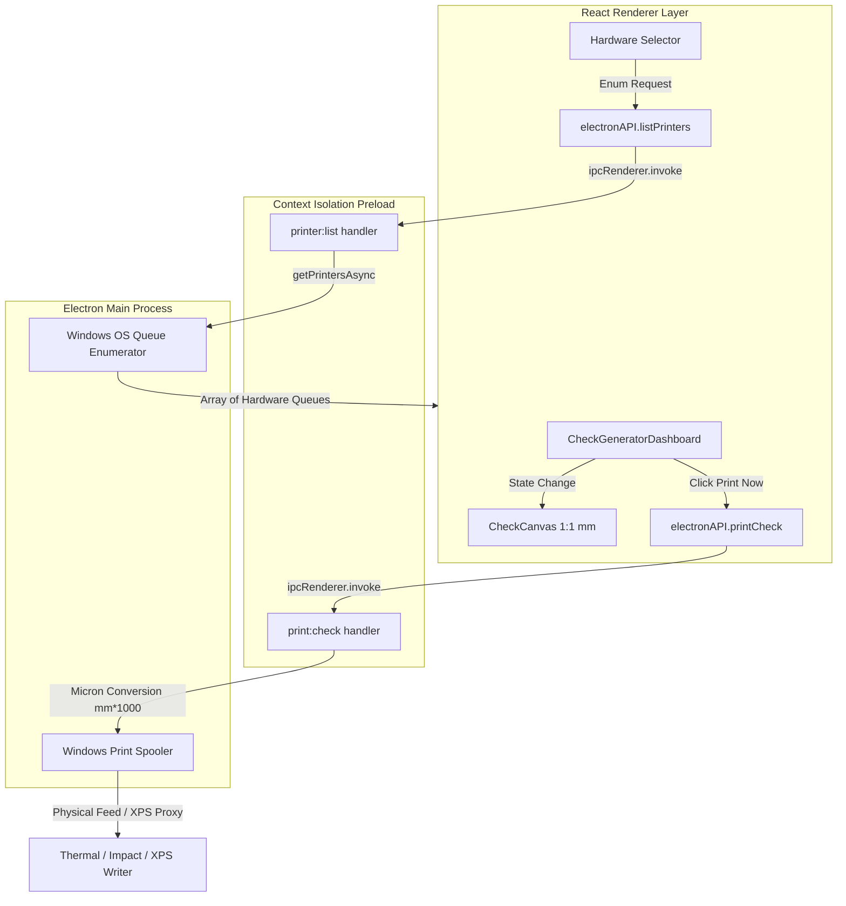
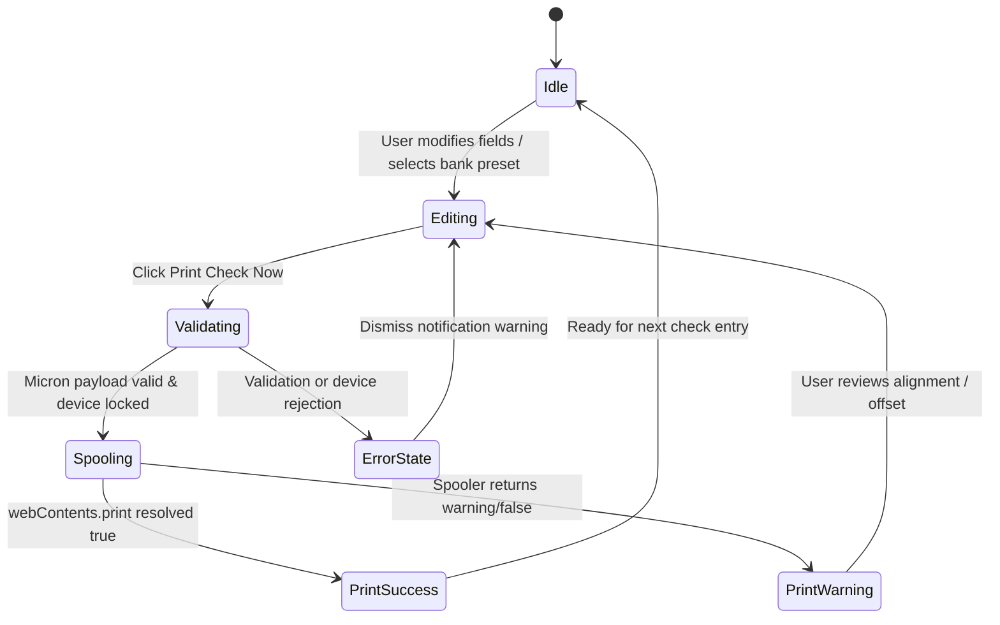
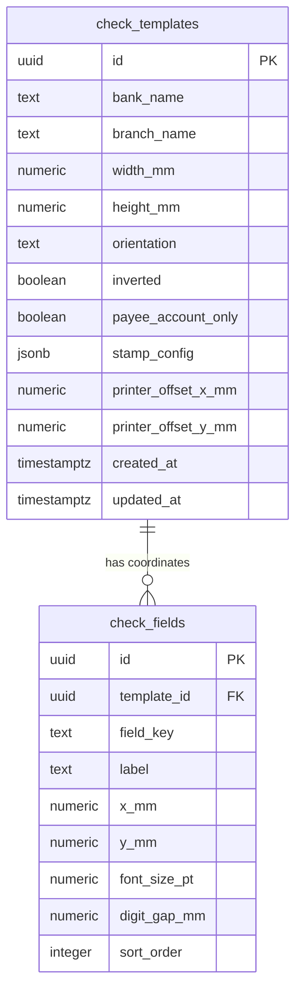

<div align="center">

# 🖨️ VisionCheck Pro (VisionBird CheckCraft)
**Micron-Precision Desktop Check Printing & Enterprise Layout Calibration Engine**


</div>

---

## ⚡ Overview
**VisionCheck Pro** is a high-precision desktop workstation utility engineered for local Windows thermal and impact check printers. It bridges visual DOM-to-micron canvas rendering with raw Windows spooler execution, featuring real-time Pakistani/International number-to-words conversion (Lakh/Crore/Million), multi-warehouse template synchronization via Supabase, and sub-millimeter coordinate calibration.

---

## 🏛️ Architecture Layers

| Layer | Location | Responsibility |
| :--- | :--- | :--- |
| **1. Presentation Layer** | `src/features/`, `src/components/` | Fluent UI form panels, 1:1 millimeter SVG/DOM preview canvas, toast alerts. |
| **2. Domain / Business Layer** | `src/domain/`, `src/core/` | Lakh/Crore/Million word parsing, amount comma-formatting, Supabase repository sync. |
| **3. IPC / Bridge Layer** | `preload.cjs`, `electron.cjs` | Context isolation security boundary, typed RPC invocation (`printer:list`, `print:check`). |
| **4. Native OS Spooler Layer** | Windows Print Spooler / Chromium API | Micron-to-micron dimensions (`mm * 1000`), zero margin override (`marginType: 'none'`). |

---

## 📁 Repository Structure

```text
project/
├── 📁 release/                 # Windows NSIS customer installer
├── 📁 src/
│   ├── 📁 app/                 # Root App lifecycle & MasterLayout state orchestration
│   ├── 📁 components/          # Fluent UI primitives, Toast provider, MasterLayout
│   ├── 📁 core/                # Template repository & Supabase sync layer
│   ├── 📁 domain/              # Number-to-words currency & locale formatters
│   ├── 📁 features/
│   │   ├── 📁 calibration/     # 1:1 mm grid overlay & coordinate adjustment studio
│   │   ├── 📁 canvas/          # Micron-scaled check DOM render view
│   │   └── 📁 generator/       # Quick transaction input, self/payee & hardware selector
│   ├── 📁 helpers/             # ISO date conversion & formatting utilities
│   ├── 📁 styles/              # Tailwind CSS entry & Fluent shadow styles
│   └── 📁 types/               # TypeScript domain interfaces (CheckTemplate, FieldLayout)
├── 📄 electron.cjs             # Main process IPC bridge, hardware targeting & telemetry
├── 📄 preload.cjs              # Context isolation bridge (exposeInMainWorld)
└── 📄 package.json             # Build matrix, electron-builder & dependency definitions

```

---

## 🔄 System Architecture & Control Flow



---

## 🔄 State Machine Lifecycle



---

## 💾 Database Schema (PostgreSQL / Supabase)

### ERD Diagram



### Table DDL Reference

* **`check_templates`**: Holds physical bank cheque stock bounding dimensions (`178.00mm x 74.00mm`), offset correction vectors, and cross-stamp JSON configurations. Defaults load *Askari Bank (Gujrat Branch)* or active presets.
* **`check_fields`**: Granular X/Y placement mappings keyed by `date`, `payee`, `amountWords`, and `numericAmount`, governed by intra-template `sort_order` (1–4).

---

## 🛠️ Tech Stack & Hardware Specifications

| Layer | Technology | Purpose |
| --- | --- | --- |
| **Desktop Runtime** | Electron (`electron.cjs`) | Native Windows spooler routing & single-instance lock |
| **UI Framework** | React 19 + Vite | High-framerate responsive layout studio & split-panel form |
| **Styling** | Tailwind CSS + Fluent Design | High-contrast enterprise forms, orange accent (`#ff7a00`) |
| **Sync / Storage** | Supabase (PostgreSQL) | Multi-terminal template sharing & offline/local fallbacks |
| **Print Engine** | Chromium WebContents Print | Micron-precision page sizing (`mm * 1000`), zero margins (`marginType: 'none'`) |

---

## 💻 Local Setup Guide

### Prerequisites

* **Node.js**: v18.x or v20.x LTS recommended
* **Package Manager**: npm (bundled with Node)
* **OS**: Windows 10/11 (required for native spooler testing via XPS/thermal hardware)

### Step 1: Clone & Install Dependencies

```bash
git clone [https://github.com/haiderali455/visioncheck-pro.git](https://github.com/haiderali455/visioncheck-pro.git)
cd visioncheck-pro
npm install

```

### Step 2: Configure Environment Variables

Create a `.env` file in the root directory for local Supabase integration:

```env
VITE_SUPABASE_URL=your-supabase-project-url
VITE_SUPABASE_ANON_KEY=your-supabase-anon-key

```

### Step 3: Run Development Server (HMR + Electron Dev)

```bash
npm run electron:dev

```

> *Note*: Vite dev server boots on `http://localhost:5173` while Electron loads the shell container. Restart terminal and app if editing `electron.cjs`.

---

## 📦 Production Release & Packaging Guide

### Windows Customer Installer

The project already includes its Electron main process in `electron.cjs` and
its isolated preload bridge in `preload.cjs`; a second `main.js` is not needed.
The main process opens the packaged Vite build from `dist/index.html`, maximizes
the application window, and exposes only the printer APIs over IPC. The
renderer uses `contextIsolation`, disables `nodeIntegration`, and enables the
Chromium security boundary.

The `build` configuration in `package.json` produces an x64 Windows **NSIS
one-click installer only**. It creates a desktop and Start Menu shortcut and
launches the application when installation completes. The output directory is
`release/`, and the installer filename follows
`VisionCheck-Pro-Setup-<version>.exe`.

#### Requirements

- Windows 10/11 x64 build machine (or a compatible Windows CI runner).
- Node.js 20.19+ or 22.12+ with npm.
- Network access for dependency and Electron downloads on a clean build.
- A Windows `.ico` file at `public/icon.ico`. The configured icon is a
  multi-size icon derived from `public/logo.png`; replace it at that path with
  the final customer-approved icon before release if different branding is
  required. Electron-builder requires an icon containing a 256 × 256 image.

#### Build from a clean checkout

```powershell
git clone <repository-url>
cd <repository-folder>
npm ci
npm run dist:win
```

`dist:win` verifies the Electron binary, runs the TypeScript type-check and Vite
production build, then invokes electron-builder for NSIS x64 packaging without
publishing to a release service. The customer installer is written to:

```text
release/VisionCheck-Pro-Setup-<version>.exe
```

Only the NSIS installer target is enabled; no portable executable is built.
Before distributing the installer, test it on a clean Windows machine, verify
that the desktop shortcut and first launch work, and exercise printer discovery
and check printing against the target printer. For CI/CD, use a Windows runner
and the same clean-checkout build sequence above, then publish only the
generated `.exe` as the customer installer. Electron-builder may also leave
update metadata and an unpacked staging directory under `release/`; these are
not required for one-time installer distribution. Keep signing certificates
and Supabase credentials in the CI secret store; never commit them to the
repository. If the Vite build needs Supabase configuration, provide
`VITE_SUPABASE_URL` and `VITE_SUPABASE_ANON_KEY` from CI secrets as build-time
environment variables. For a trusted Windows release, configure an
Authenticode certificate through electron-builder's `CSC_LINK` and
`CSC_KEY_PASSWORD` environment variables; installers built without a signing
certificate may show Windows SmartScreen warnings.

To use another app identity, update `appId` in `package.json`. To change the
product branding, update `productName` and replace `public/icon.ico` with a
valid Windows icon file.

### Enterprise / Client Deployment Notes

* **Custom Form Registration**: For impact/thermal continuous feed checks, open Windows **Print Server Properties** on the target client machine, create a custom paper form matching check dimensions (`178mm x 74mm`), and assign it to the thermal printer driver.
* **Database Isolation**: Provide client-specific Supabase credentials through build-time environment variables before running `npm run dist:win` if separate tenant databases are required. Never commit production credentials.

---

## 🚀 Hardware Validation Matrix

| Target Queue Type | Behavior / Suitability | Action Required |
| --- | --- | --- |
| **Physical Thermal / Impact** | Direct physical feeding, exact head alignment | Calibrate `printerOffsetXmm`/`printerOffsetYmm` |
| **Microsoft XPS Document Writer** | Validates custom micron page geometry via software spooler | Recommended pre-hardware validation proxy |
| **Fax / PDF Queues** | Intercepts with UI wizards or generates virtual files | **Do not use** for direct thermal check production |

---

## 🤝 Contribution & Maintenance Guidelines

1. **Branching**: Feature branches off `main` with prefix `feat/`, `fix/`, or `calib/`.
2. **Coordinate Locks**: Any adjustment to check field coordinates must reference 1:1 millimeter calibration scales (`Scale: ~4.97 px/mm`).
3. **IPC Safety**: Expose new native OS actions strictly through `preload.cjs` inside `contextBridge.exposeInMainWorld('electronAPI', ...)`.
4. **Environment**: Never commit production Supabase URL/Anon keys; bundle via `.env.production` during CI/CD package runs.

```
