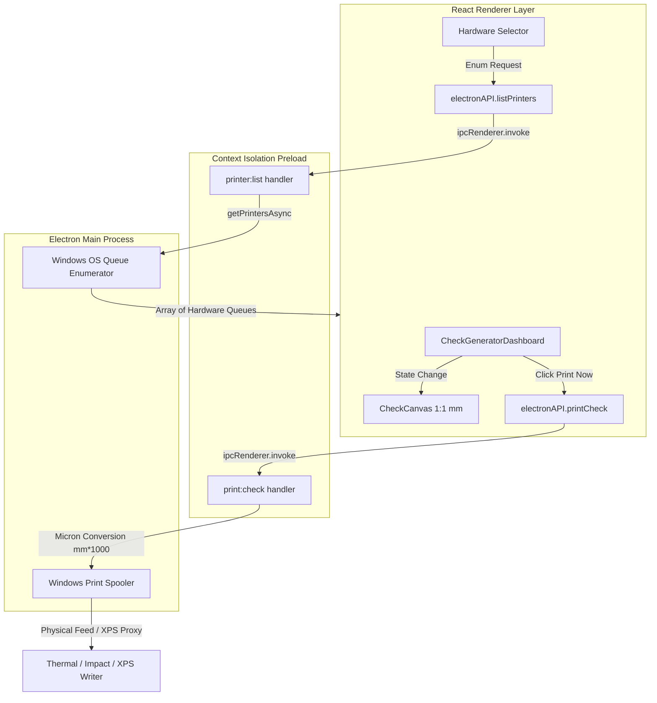
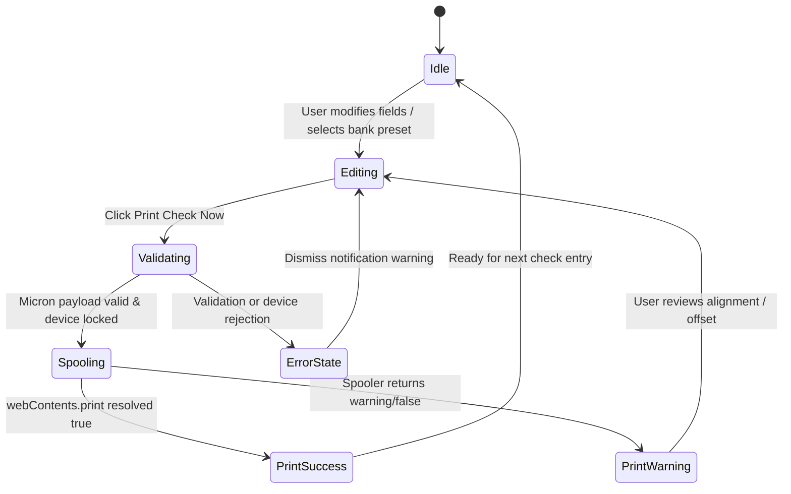
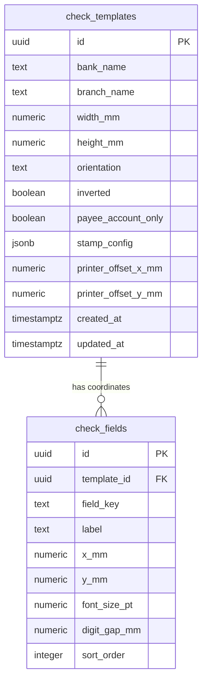

<div align="center">

# 🖨️ VisionCheck Pro (VisionBird CheckCraft)
**Micron-Precision Desktop Check Printing & Enterprise Layout Calibration Engine**


</div>

---

## ⚡ Overview
**VisionCheck Pro** is a high-precision desktop workstation utility engineered for local Windows thermal and impact check printers. It bridges visual DOM-to-micron canvas rendering with raw Windows spooler execution, featuring real-time Pakistani/International number-to-words conversion (Lakh/Crore/Million), multi-warehouse template synchronization via Supabase, and sub-millimeter coordinate calibration.

---

## 🏛️ Architecture Layers

| Layer | Location | Responsibility |
| :--- | :--- | :--- |
| **1. Presentation Layer** | `src/features/`, `src/components/` | Fluent UI form panels, 1:1 millimeter SVG/DOM preview canvas, toast alerts. |
| **2. Domain / Business Layer** | `src/domain/`, `src/core/` | Lakh/Crore/Million word parsing, amount comma-formatting, Supabase repository sync. |
| **3. IPC / Bridge Layer** | `preload.cjs`, `electron.cjs` | Context isolation security boundary, typed RPC invocation (`printer:list`, `print:check`). |
| **4. Native OS Spooler Layer** | Windows Print Spooler / Chromium API | Micron-to-micron dimensions (`mm * 1000`), zero margin override (`marginType: 'none'`). |

---

## 📁 Repository Structure

```text
project/
├── 📁 release/                 # Electron-builder standalone outputs (.exe / portable)
├── 📁 src/
│   ├── 📁 app/                 # Root App lifecycle & MasterLayout state orchestration
│   ├── 📁 components/          # Fluent UI primitives, Toast provider, MasterLayout
│   ├── 📁 core/                # Template repository & Supabase sync layer
│   ├── 📁 domain/              # Number-to-words currency & locale formatters
│   ├── 📁 features/
│   │   ├── 📁 calibration/     # 1:1 mm grid overlay & coordinate adjustment studio
│   │   ├── 📁 canvas/          # Micron-scaled check DOM render view
│   │   └── 📁 generator/       # Quick transaction input, self/payee & hardware selector
│   ├── 📁 helpers/             # ISO date conversion & formatting utilities
│   ├── 📁 styles/              # Tailwind CSS entry & Fluent shadow styles
│   └── 📁 types/               # TypeScript domain interfaces (CheckTemplate, FieldLayout)
├── 📄 electron.cjs             # Main process IPC bridge, hardware targeting & telemetry
├── 📄 preload.cjs              # Context isolation bridge (exposeInMainWorld)
└── 📄 package.json             # Build matrix, electron-builder & dependency definitions

```

---

## 🔄 System Architecture & Control Flow



---

## 🔄 State Machine Lifecycle



---

## 💾 Database Schema (PostgreSQL / Supabase)

### ERD Diagram



### Table DDL Reference

* **`check_templates`**: Holds physical bank cheque stock bounding dimensions (`178.00mm x 74.00mm`), offset correction vectors, and cross-stamp JSON configurations. Defaults load *Askari Bank (Gujrat Branch)* or active presets.
* **`check_fields`**: Granular X/Y placement mappings keyed by `date`, `payee`, `amountWords`, and `numericAmount`, governed by intra-template `sort_order` (1–4).

---

## 🛠️ Tech Stack & Hardware Specifications

| Layer | Technology | Purpose |
| --- | --- | --- |
| **Desktop Runtime** | Electron (`electron.cjs`) | Native Windows spooler routing & single-instance lock |
| **UI Framework** | React 19 + Vite | High-framerate responsive layout studio & split-panel form |
| **Styling** | Tailwind CSS + Fluent Design | High-contrast enterprise forms, orange accent (`#ff7a00`) |
| **Sync / Storage** | Supabase (PostgreSQL) | Multi-terminal template sharing & offline/local fallbacks |
| **Print Engine** | Chromium WebContents Print | Micron-precision page sizing (`mm * 1000`), zero margins (`marginType: 'none'`) |

---

## 🖨️ Print Page and Cheque Layout

Print output uses an **A4 portrait sheet (210 × 297 mm)** as its page reference.
The selected cheque template from the database remains the physical cheque
layout: its width, height, field coordinates, and printer calibration offsets
are expressed in millimetres. A landscape-sized template is rotated
counterclockwise for portrait output so its right/date edge faces the top of the
page. This rotation changes the template's orientation, not its physical size.

The eight date digits are laid out as one group. If their configured cell widths
and gaps would exceed the template width, the group is proportionally reduced
and shifted left only as much as needed to keep it inside the template.

The A4 page's CSS margins are zero. Physical printers can still have
non-printable areas at the edges, which depend on the printer and driver;
configured `printerOffsetXmm` and `printerOffsetYmm` values compensate for
hardware alignment. Validate final placement with the target printer or its
print preview before printing cheque stock.

---

## 💻 Local Setup Guide

### Prerequisites

* **Node.js**: v18.x or v20.x LTS recommended
* **Package Manager**: npm (bundled with Node)
* **OS**: Windows 10/11 (required for native spooler testing via XPS/thermal hardware)

### Step 1: Clone & Install Dependencies

```bash
git clone [https://github.com/haiderali455/visioncheck-pro.git](https://github.com/haiderali455/visioncheck-pro.git)
cd visioncheck-pro
npm install

```

### Step 2: Configure Environment Variables

Create a `.env` file in the root directory for local Supabase integration:

```env
VITE_SUPABASE_URL=your-supabase-project-url
VITE_SUPABASE_ANON_KEY=your-supabase-anon-key

```

### Step 3: Run Development Server (HMR + Electron Dev)

```bash
npm run electron:dev

```

> *Note*: Vite dev server boots on `http://localhost:5173` while Electron loads the shell container. Restart terminal and app if editing `electron.cjs`.

---

## 📦 Production Release & Packaging Guide

### Package Configuration (`package.json`)

Ensure your `package.json` includes `electron-builder` settings targeting Windows NSIS and Portable formats:

```json
{
  "scripts": {
    "build:ui": "vite build",
    "package:win": "npm run build:ui && electron-builder --win"
  },
  "build": {
    "appId": "com.visionbird.checkcraft",
    "productName": "VisionCheck Pro",
    "directories": {
      "output": "release"
    },
    "files": [
      "dist/**/*",
      "electron.cjs",
      "preload.cjs"
    ],
    "win": {
      "target": ["nsis", "portable"],
      "icon": "public/icon.ico"
    }
  }
}

```

### Step-by-Step Release Generation

1. Validate frontend build and TypeScript types.
2. Run the packaging command:
```bash
npm run package:win

```


3. Locate compiled artifacts inside `release/`:
* `VisionCheck Pro Setup X.X.X.exe` (NSIS installer)
* `VisionCheck Pro X.X.X portable.exe` (Portable binary)


### Enterprise / Client Deployment Notes

* **Custom Form Registration**: For impact/thermal continuous feed checks, open Windows **Print Server Properties** on the target client machine, create a custom paper form matching check dimensions (`178mm x 74mm`), and assign it to the thermal printer driver.
* **Database Isolation**: Pass client-specific Supabase credentials via a `.env.production` file prior to running `package:win` if separate tenant databases are required.

---

## 🚀 Hardware Validation Matrix

| Target Queue Type | Behavior / Suitability | Action Required |
| --- | --- | --- |
| **Physical Thermal / Impact** | Direct physical feeding, exact head alignment | Calibrate `printerOffsetXmm`/`printerOffsetYmm` |
| **Microsoft XPS Document Writer** | Validates custom micron page geometry via software spooler | Recommended pre-hardware validation proxy |
| **Fax / PDF Queues** | Intercepts with UI wizards or generates virtual files | **Do not use** for direct thermal check production |

---

## 🤝 Contribution & Maintenance Guidelines

1. **Branching**: Feature branches off `main` with prefix `feat/`, `fix/`, or `calib/`.
2. **Coordinate Locks**: Any adjustment to check field coordinates must reference 1:1 millimeter calibration scales (`Scale: ~4.97 px/mm`).
3. **IPC Safety**: Expose new native OS actions strictly through `preload.cjs` inside `contextBridge.exposeInMainWorld('electronAPI', ...)`.
4. **Environment**: Never commit production Supabase URL/Anon keys; bundle via `.env.production` during CI/CD package runs.

```
