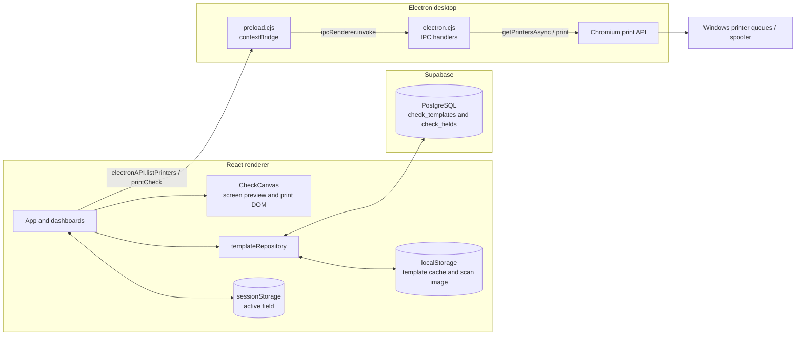
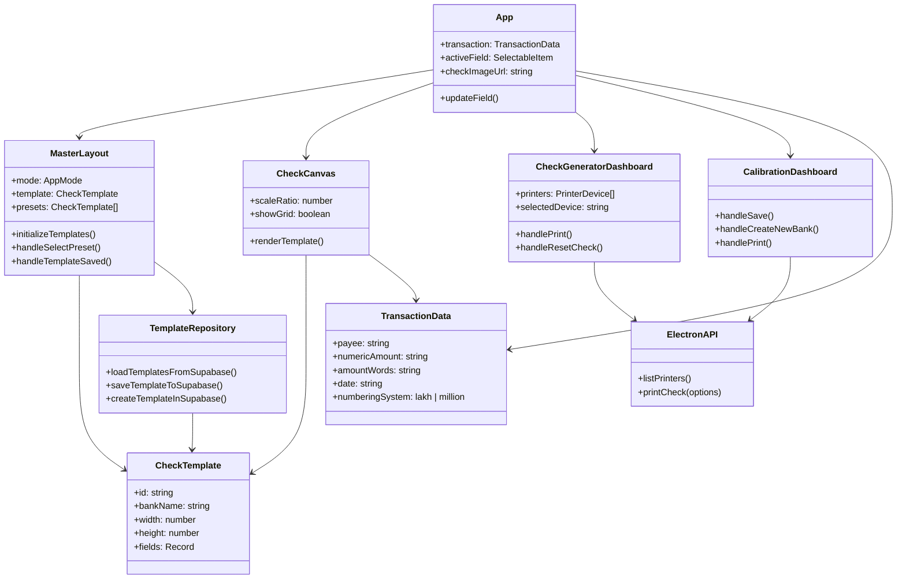
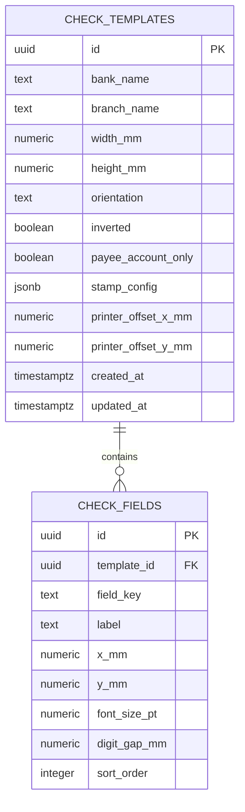

# VisionCheck Pro

<div align="center">


**Cheque template design · Millimetre calibration · Desktop printing**

</div>

VisionCheck Pro is a Windows desktop application for laying out cheque templates, entering cheque data, previewing the print layout, and sending print jobs to an installed printer. Templates can be synchronized through Supabase; a browser-local cache is used when Supabase is unavailable or not configured.

> [!IMPORTANT]
> **🔒 Proprietary software — all rights reserved.** See [LICENSE.md](./LICENSE.md). Repository access does not grant permission to use, copy, modify, or distribute the software.

> [!TIP]
> **🚀 Quick start:** install Node.js 20.19+ or 22.12+, run `npm ci`, copy `.env.example` to `.env`, then run `npm run electron:dev`. Supabase configuration is optional for local/default-template use.

## 📚 Contents

- [✨ Capabilities](#capabilities)
- [🏛️ System architecture](#system-architecture)
- [🗂️ Repository folder structure](#repository-folder-structure)
- [🔄 Data flow](#data-flow)
- [🎛️ Application control state](#application-control-state)
- [🧩 Data model and ERD](#data-model-and-erd)
- [🛠️ Technology and versions](#technology-and-versions)
- [⚙️ Hardcoded and dynamic behavior](#hardcoded-and-dynamic-behavior)
- [📄 Source file guide](#source-file-guide)
- [💻 Local setup and running](#local-setup-and-running)
- [🩺 Troubleshooting](#troubleshooting)
- [📦 Packaging and release](#packaging-and-release)
- [🤝 Contributing and license](#contributing-and-license)

<a id="capabilities"></a>
## ✨ Capabilities

- Enter payee, date, numeric amount, and amount in words.
- Convert amounts to words using lakh/crore or million/billion grouping.
- Preview cheque fields against an optional scanned background, with a grid and millimetre coordinates.
- Create and adjust bank templates, field positions, font sizes, stamp settings, and printer offsets.
- Load and save cheque templates through Supabase, with a `localStorage` template cache.
- Enumerate installed printers and request a silent print through Electron's isolated IPC bridge.
- Build a Windows x64 NSIS one-click installer.

The app does **not** currently provide sign-in, transaction history, transaction persistence, a release-publishing pipeline, or a dedicated automated test suite.

<a id="system-architecture"></a>
## 🏛️ System architecture

The application is a Vite/React renderer hosted in Electron. React owns UI and working state; the template repository talks directly to Supabase from the renderer; only printer enumeration and print dispatch cross the Electron preload bridge.



### 🧱 Logical component/class diagram

The TypeScript data structures are interfaces and the React UI is composed of function components; this diagram shows logical ownership and collaboration rather than JavaScript runtime classes.



<a id="repository-folder-structure"></a>
## 🗂️ Repository folder structure

This is the source and configuration layout. Generated output and installed dependencies (`dist/`, `release/`, and `node_modules/`) are omitted.

```text
VisionCheck-Pro/
├── public/
│   ├── icon.ico
│   └── logo.png
├── scripts/
│   └── ensure-electron.cjs
├── src/
│   ├── app/
│   │   ├── App.tsx
│   │   └── Providers.tsx
│   ├── components/
│   │   ├── helpers/
│   │   │   └── dateUtils.ts
│   │   └── ui/
│   │       ├── defaultTemplate.ts
│   │       ├── LoadingOverlay.tsx
│   │       ├── MasterLayout.tsx
│   │       └── Toast.tsx
│   ├── core/
│   │   ├── supabase.ts
│   │   └── templateRepository.ts
│   ├── domain/
│   │   └── numberToWords.ts
│   ├── features/
│   │   ├── calibration/
│   │   │   └── CalibrationDashboard.tsx
│   │   ├── canvas/
│   │   │   └── CheckCanvas.tsx
│   │   └── generator/
│   │       └── CheckGeneratorDashboard.tsx
│   ├── styles/
│   │   └── index.css
│   ├── types/
│   │   └── index.ts
│   ├── electronBridge.ts
│   ├── main.tsx
│   └── vite-env.d.ts
├── supabase/
│   ├── migrations/
│   │   ├── 20260916000000_check_templates_orientation.sql
│   │   ├── 20260921000000_force_portrait_orientation.sql
│   │   └── visionpro_migration.sql
│   └── test/
├── .env.example
├── .gitignore
├── CONTRIBUTING.md
├── electron.cjs
├── index.html
├── LICENSE.md
├── package.json
├── package-lock.json
├── postcss.config.js
├── preload.cjs
├── README.md
├── tailwind.config.js
├── tsconfig.app.json
├── tsconfig.json
├── tsconfig.node.json
└── vite.config.ts
```

The `supabase/test/` directory is currently empty; no automated application test suite is configured.

<a id="data-flow"></a>
## 🔄 Data flow

### 🌅 Startup and template loading

1. `src/main.tsx` mounts `App` under `Providers` and the toast context.
2. `MasterLayout` starts in **Generate** mode and loads templates.
3. `templateRepository` reads the Supabase `check_templates` and `check_fields` tables when environment configuration is present.
4. A successful load refreshes the local template cache. If Supabase is not configured or loading the parent table fails, the repository returns the cached templates. If there are no templates, the UI uses the built-in Askari Bank default.
5. The generator initially selects the Askari/Gujrat preset when available (otherwise the first preset), and displays the selected template and current transaction state on the canvas.

### 🖨️ Generate and print

1. The generator updates transaction state in React as the user enters values. Amount words are recalculated on numeric amount edits and when switching numbering systems.
2. `CheckCanvas` lays out data using template coordinates in millimetres. Its screen preview is scaled to fit the available viewport; the preview is not a guaranteed physical-size monitor calibration.
3. In Electron, the print action calls `window.electronAPI.printCheck` through preload IPC. If that API is unavailable (for example, browser-only Vite mode), the generator falls back to `window.print()`.
4. Electron selects the requested printer or a preferred installed printer, then invokes Chromium's print API. The print page is a fixed A4 portrait reference sheet with zero margins. The renderer positions/rotates the cheque template on that sheet and applies the configured offsets.
5. The generator reports dispatch success or a print warning/error. A successful IPC response means the print job was accepted by Chromium/the spooler; it does not prove that paper fed correctly or that alignment is accurate.

### 🎚️ Calibration and template persistence

1. Calibration edits update the active `CheckTemplate` in React state; the canvas reflects the edits immediately.
2. Save writes a local cache copy first. If Supabase is configured, the repository upserts the template and its fields; database errors are surfaced to the calibration UI.
3. Creating a template copies the current dimensions and field layout, applies the new bank/branch names, generates a UUID, and saves it.
4. Templates contain layout/configuration data only. Transaction values are not sent to Supabase by this workflow.

### 📐 Print geometry

The renderer uses CSS millimetre dimensions for the cheque and its fields, then applies an A4 portrait `@page` rule for printing. Electron's `print:check` handler independently specifies a 210 × 297 mm page (210,000 × 297,000 microns), no margins, portrait orientation, and a 100% scale factor. The uploaded scan and screen-only calibration grid are hidden in print output. Printer offsets are applied by the renderer's print stylesheet, not by a native driver offset API.

<a id="application-control-state"></a>
## 🎛️ Application control state

There is no separate state-machine library. This diagram describes the UI's actual high-level modes and async operations; transaction/template data remain ordinary React state.

```text
                          +----------------------+
                          |   Load templates     |
                          +----------+-----------+
                                     |
                 Supabase, cache, or built-in default
                                     |
                                     v
                          +----------------------+
                 +------->|    Generate mode     |<-------+
                 |        +----------+-----------+        |
                 |                   |                    |
                 |             open calibration            |
                 |                   v                    |
                 |        +----------------------+        |
                 +--------|   Calibrate mode     |--------+
                   open   +----------+-----------+  open
                 generator            |             generator
                              edit template
                                     |
                                     v
                          +----------------------+
                          | Edit template layout |
                          +----------+-----------+
                                     |
                               save or create
                                     v
                          +----------------------+
                          |   Save template      |
                          +----------+-----------+
                                     |
                     success or error notification
                                     |
                                     +------> Calibrate mode

      Generate mode or Calibrate mode
                    |
              request print
                    v
          +-------------------+
          |  Print dispatch   |
          +---------+---------+
                    |
         attempt completes; return
           to the originating mode
```

> **🌟 Latest contributor:** Haider Ali

> **ℹ️ Print status:** The generator can display an application print success, warning, or error toast. Calibration print currently does not inspect the returned print result, so it does not provide the same success feedback.

<a id="data-model-and-erd"></a>
## 🧩 Data model and ERD

Supabase stores reusable template configuration in two tables. The application expects these columns (field names below use the PostgreSQL column names):

| Table | Expected data |
| --- | --- |
| `check_templates` | `id` (UUID), `bank_name`, `branch_name`, `width_mm`, `height_mm`, `orientation`, `inverted`, `payee_account_only`, `stamp_config` (JSON), `printer_offset_x_mm`, `printer_offset_y_mm`, `created_at`, `updated_at` |
| `check_fields` | `id` (UUID), `template_id`, `field_key`, `label`, `x_mm`, `y_mm`, `font_size_pt`, `digit_gap_mm`, `sort_order` |



`check_fields.template_id` should reference `check_templates.id` with cascading deletion, and `(template_id, field_key)` should be unique for the app's upsert behavior. The four field keys currently supported by the UI are `date`, `payee`, `amountWords`, and `numericAmount`.

SQL files in `supabase/migrations/` reflect multiple schema revisions. Review and reconcile them with the target Supabase database before applying anything; do not blindly execute every file in order. The application has **no sign-in or user-level authorization**. Supabase's anon/publishable key is included in the renderer build and is not a secret. Do not ship a service-role key. Configure a deployment-appropriate access/authentication strategy and restrictive database policies before exposing a project to untrusted users.

<a id="technology-and-versions"></a>
## 🛠️ Technology and versions

Versions below are the versions declared in `package.json`; locked versions are shown where verified from the current lockfile/install.

| Technology | Version | Role |
| --- | --- | --- |
| Node.js | 20.19+ or 22.12+ recommended for Vite 8; Windows x64 release build | Tooling/runtime |
| npm | Bundled with Node.js; npm 11.17.0 in the inspected development environment | Package manager |
| Electron | `^36.9.5` (installed 36.9.5) | Desktop shell, IPC, Chromium printing |
| Chromium | Bundled with Electron | Renderer and print engine |
| React / React DOM | `^18.3.1` (installed 18.3.1) | UI |
| Vite | `^8.2.2` (installed 8.2.2) | Dev server and renderer bundler |
| TypeScript | `^5.5.3` (installed 5.6.3) | Static typing |
| Supabase JS | `^2.57.4` (installed 2.57.4) | Template data access |
| Tailwind CSS | `^3.4.1` (installed 3.4.17) | Styling |
| Lucide React | `^0.446.0` | Icons |
| electron-builder | `^26.0.12` | Windows NSIS packaging |
| ESLint | `^9.9.1` | Linting |
| PostCSS / Autoprefixer | `^8.4.35` / `^10.4.18` | CSS processing |
| `concurrently`, `wait-on`, `cross-env` | `^9.1.2`, `^8.0.3`, `^7.0.3` | Development startup orchestration |

The project uses PostgreSQL through Supabase; the hosted database version is managed by Supabase and is not pinned here.

<a id="hardcoded-and-dynamic-behavior"></a>
## ⚙️ Hardcoded and dynamic behavior

### 📌 Hardcoded defaults and constraints

| Fixed in the application | Details |
| --- | --- |
| Initial template | Askari Bank, Gujrat Branch, 178 × 74 mm; coordinates, labels, font sizes, and digit gap are in `src/components/ui/defaultTemplate.ts`. |
| Field set and stamp | Four supported fields; default “PAYEE'S ACCOUNT ONLY” stamp text and geometry. |
| Amount wording | English words and lakh/crore or million/billion grouping in `src/domain/numberToWords.ts`. |
| Print sheet | A4 portrait reference page, zero margins, and 100% Electron scale. |
| Product settings | Branding, window constraints, mode names, and NSIS installer identity. |
| Orientation behavior | Portrait in the TypeScript model; renderer rotates the cheque layout based on dimensions/inversion. |

### 🔀 Dynamic values and persistence

| Dynamic data | Where it comes from / how it persists |
| --- | --- |
| Template dimensions, labels, stamp, offsets, and field coordinates | Selected template; remotely loaded/saved in Supabase when configured. |
| Template cache and uploaded scan | Browser `localStorage`; scan is not uploaded to Supabase. |
| Transaction inputs and active mode | React runtime state; transactions are not stored as history. |
| Active canvas field | `sessionStorage` for the current app session. |
| Current date and installed printers | Local system clock and operating system printer queues. |
| Supabase project URL/key | Vite `.env` build-time values; changing packaged settings requires a new renderer/installer build. |

<a id="source-file-guide"></a>
## 📄 Source file guide

| File | Responsibility |
| --- | --- |
| `src/main.tsx` | React renderer entry point; mounts the app, providers, and global CSS. |
| `src/app/App.tsx` | Owns transaction, selected field, and uploaded image state; connects canvas, generator, calibration, and layout. |
| `src/app/Providers.tsx` | Installs the toast notification provider. |
| `src/components/ui/MasterLayout.tsx` | Loads templates, owns mode/template/preset state, and renders the application frame. |
| `src/components/ui/defaultTemplate.ts` | Built-in Askari/Gujrat template and default field geometry. |
| `src/components/ui/Toast.tsx` | Toast context, notification helpers, and notification UI. |
| `src/components/ui/LoadingOverlay.tsx` | Template-loading overlay. |
| `src/components/helpers/dateUtils.ts` | ISO date and cheque date-digit conversion helpers. |
| `src/features/generator/CheckGeneratorDashboard.tsx` | Transaction inputs, amount conversion, printer selection, reset, and generator print action. |
| `src/features/calibration/CalibrationDashboard.tsx` | Template creation, layout/stamp/printer calibration controls, save, and calibration print action. |
| `src/features/canvas/CheckCanvas.tsx` | Screen-scaled template preview, grid/scan overlay, field rendering, and print stylesheet. |
| `src/core/templateRepository.ts` | Supabase template reads/upserts and local cache fallback. |
| `src/core/supabase.ts` | Reads Vite Supabase configuration and creates the client. |
| `src/domain/numberToWords.ts` | Lakh/million amount-to-words and numeric currency formatting. |
| `src/types/index.ts` | App, template, transaction, toast, database-row, and Electron bridge TypeScript types. |
| `src/electronBridge.ts` | Renderer-facing `window.electronAPI` TypeScript declaration. |
| `src/styles/index.css` | Tailwind entry point, global styles, design tokens, and print styles. |
| `src/vite-env.d.ts` | Vite client type declarations. |
| `electron.cjs` | Electron main process, secure window configuration, printer enumeration, and print IPC handlers. |
| `preload.cjs` | Exposes the minimal printer API using `contextBridge` and `ipcRenderer.invoke`. |
| `scripts/ensure-electron.cjs` | Verifies or recovers the Electron binary after dependency installation. |
| `supabase/migrations/*.sql` | Database setup/schema revision scripts; review before use against a live project. |
| `public/logo.png`, `public/icon.ico` | UI branding and Windows application/installer icon assets. |
| `index.html` | Vite renderer HTML shell. |
| `package.json` | Scripts, dependencies, app version, and electron-builder configuration. |
| `vite.config.ts` | Vite base path, React plugin, and `@` source alias. |
| `tsconfig*.json` | TypeScript project/compiler configuration. |
| `eslint.config.js`, `tailwind.config.js`, `postcss.config.js` | Linting and CSS tooling configuration. |
| `.env.example`, `.gitignore` | Environment-variable template and ignored local/build files. |
| `CONTRIBUTING.md`, `LICENSE.md` | Contribution process and proprietary rights notice. |

Build output (`dist/`), packaged output (`release/`), dependencies, and local environment files are generated/local data and are not source files.

<a id="local-setup-and-running"></a>
## 💻 Local setup and running

### ✅ Requirements

- Windows 10/11 x64 for desktop development and printer testing.
- Node.js 20.19+ or 22.12+ and npm. Use an active LTS version compatible with Vite 8.
- Network access on initial install so npm/Electron can fetch dependencies.
- A Supabase project with the required `check_templates` and `check_fields` schema for remote template sync (optional for the local-cache/default-template UI).

### 📥 Install and configure

```powershell
git clone <authorized-repository-url>
cd <repository-folder>
npm ci
Copy-Item .env.example .env
```

Set the following values in `.env` if using Supabase:

```dotenv
VITE_SUPABASE_URL=https://<project-ref>.supabase.co
VITE_SUPABASE_ANON_KEY=<publishable-or-anon-key>
```

The anon/publishable key is client-visible; never put a Supabase service-role key in `.env` or a packaged build. If credentials are omitted, template reads use the local cache and built-in default. Confirm Supabase table structure and access policies before connecting.

### ☁️ Supabase Free plan: pause, wake, and keep it available

> [!WARNING]
> Supabase Free projects may be paused after a period of inactivity (commonly around 7 days). The Free plan does not provide a setting that guarantees an always-on project. Check Supabase's current [project pausing guide](https://supabase.com/docs/guides/platform/pausing-projects) and [pricing](https://supabase.com/pricing), because plan limits and policies can change.

#### 🔔 Wake a paused project

1. Sign in to the Supabase Dashboard and open the organization containing the project.
2. Select the project and check its status in the project list or project settings.
3. If it is paused, choose **Restore project** (or the dashboard's equivalent resume action) and confirm.
4. Wait for Supabase to finish restoring it, then retry the app. Verify the project's API URL and key in **Project Settings → API** if requests still fail.

Restoration is not instantaneous. If the dashboard says the project is deleted, outside its restore window, or cannot be restored, follow Supabase's dashboard/support recovery options; do not assume an old project can always be awakened.

#### ♾️ Prevent routine inactivity pauses

- On Free, there is no supported “keep awake” toggle or guarantee against inactivity pausing. For dependable always-on use, upgrade the project to a paid plan that does not pause for inactivity, and review its current billing/usage limits.
- Do not rely on a scheduled ping, external uptime monitor, or repeated dummy database writes to defeat pausing. Such traffic is not an availability guarantee and can create security, policy, or billing problems.
- This application currently loads templates on startup and saves them when requested; it does not implement a background keep-alive. Its `localStorage` template cache and built-in default may let the UI open while Supabase is unavailable, but remote sync will not work until the project is active.
- Back up important template data independently and periodically verify that a restore is available. A Free project should not be treated as the only copy of important data.

> **💡 Recommended for this personal desktop app:** stay on Free for occasional development and accept manual wake-up; use a paid project when the app needs reliable access without manual restoration.

### ▶️ Run the desktop app

```powershell
npm run electron:dev
```

This starts Vite at `http://localhost:5173`, waits for it, then launches Electron. Renderer changes use Vite hot reload; restart Electron after changing `electron.cjs` or `preload.cjs`.

Useful commands:

```powershell
npm run dev         # Browser-only renderer; printing uses the browser fallback
npm run typecheck   # TypeScript check
npm run lint        # ESLint
npm run build       # Production Vite renderer in dist/
npm run preview     # Preview the built renderer
```

<a id="troubleshooting"></a>
## 🩺 Troubleshooting

| Symptom | Likely cause | Resolution |
| --- | --- | --- |
| `npm ci` or Electron startup fails while fetching Electron | Network/proxy restrictions or incomplete Electron cache | Check network/proxy access, retry `npm ci`, and inspect the `ensure-electron` output. Do not copy an executable from an untrusted source. |
| Vite reports an unsupported Node version or syntax | Node is below Vite 8's supported range | Use Node 20.19+ or 22.12+, open a new terminal, then reinstall with `npm ci`. |
| Supabase loading notice, empty presets, or local presets only | Missing/invalid `VITE_SUPABASE_URL` / anon key, unavailable network, schema mismatch, or database policy denial | Check the `.env` names/values and Supabase project URL, restart the dev process after changing env values, verify required tables/columns and access policies, and inspect the renderer console. |
| Supabase project appears offline or requests time out | Free project was paused after inactivity | Restore/resume it from the Supabase Dashboard as described above. Free has no guaranteed always-on switch; consider a paid plan for continuous availability. |
| A template appears to save, but does not sync remotely | The local cache is written before the remote request; Supabase may be unconfigured or the upsert may fail | Check the calibration toast and console, confirm table permissions and the `(template_id, field_key)` uniqueness constraint, then retry with network access. |
| Printer list is empty or no printer is selected | No installed queue, Electron API unavailable, or printer enumeration failed | Use `npm run electron:dev` (not only `npm run dev`), install/configure the Windows printer driver, and verify it appears in Windows printer settings. |
| Print action errors or sends to the wrong queue | Selected queue/driver issue or spooler failure | Select the intended queue in the app, verify it in Windows, clear/restart the affected queue if appropriate, and test with a non-production sheet first. |
| Printed cheque is rotated, clipped, or offset | A4 reference-page geometry, printer driver form/feed setup, or template calibration mismatch | Verify the target printer accepts the configured portrait A4 reference page, compare the physical stock and driver settings, adjust template offsets/field positions in calibration, and use a harmless test print. |
| Background scan is missing after restart or upload | Browser storage quota/private context or data URL too large | Use a smaller scan image and check browser storage. The scan is stored in local `localStorage`, not in Supabase. |
| Production window is blank or assets are missing | Incorrect base path or packaging/build mismatch | Keep Vite `base: './'`, run `npm run build`, then rebuild the installer. Do not launch Electron against a stale `dist/` folder. |
| Windows warns about an unknown publisher | Installer is not Authenticode-signed | Sign the release with an authorized certificate and verify publisher/signature before distribution; signing is not configured by default. |

Do not test printer changes with live negotiable instruments or sensitive transaction data.

<a id="packaging-and-release"></a>
## 📦 Packaging and release

The configured release target is a Windows x64 NSIS one-click installer. `npm run dist:win` checks/recoveries Electron, runs the TypeScript check, builds the Vite renderer, and invokes electron-builder with publishing disabled. The installer is written under `release/` as `VisionCheck-Pro-Setup-<version>.exe`. The installer creates desktop and Start Menu shortcuts and starts the app after install. There is no configured auto-update or GitHub release publishing workflow.

### 🏗️ Build locally

On a Windows x64 machine, from a clean, authorized checkout:

```powershell
npm ci
npm run lint
npm run dist:win
```

Set the required `VITE_SUPABASE_URL` and `VITE_SUPABASE_ANON_KEY` in the build environment only when the packaged app is intended to connect to Supabase. These values are compiled into the renderer and are not secret. Never use a service-role key.

### 🚀 Create a release

1. Confirm the change is authorized for this closed-source project and update `package.json` **and** `package-lock.json` to the intended release version. Keep the app version and installer artifact version aligned.
2. Review the diff; run `npm ci`, `npm run lint`, `npm run typecheck`, and `npm run build` (the `dist:win` script already runs typecheck and build).
3. On Windows x64, run `npm run dist:win`; confirm `release/VisionCheck-Pro-Setup-<version>.exe` exists and record its SHA-256 checksum:

   ```powershell
   Get-FileHash .\release\VisionCheck-Pro-Setup-<version>.exe -Algorithm SHA256
   ```

4. Install and test the installer on a clean Windows machine/account. Check first launch, shortcuts, Supabase configuration/policies, printer discovery, and a safe alignment test on the target printer/stock.
5. If distributing beyond a trusted development environment, sign the installer using an approved Authenticode certificate. Keep `CSC_LINK` and `CSC_KEY_PASSWORD` in a protected signing environment; do not commit the certificate or password. Verify the signed artifact and checksum.
6. Create the repository tag/release only through the project's authorized private distribution process. Attach only approved artifacts and release notes; do not upload `.env`, service-role credentials, signing secrets, or customer data.

`electron-builder` may also generate staging files and update metadata in `release/`; they are not a configured update service. The NSIS installer is the intended customer artifact. Make sure any redistributed third-party runtime/dependency notices required by their licenses are handled separately from this project's proprietary license.

<a id="contributing-and-license"></a>
## 🤝 Contributing and license

Contribution instructions and review expectations are in [CONTRIBUTING.md](./CONTRIBUTING.md). This codebase is proprietary and contributions require authorization. The project license is a closed-source all-rights-reserved notice in [LICENSE.md](./LICENSE.md); third-party dependencies remain subject to their own licenses.
